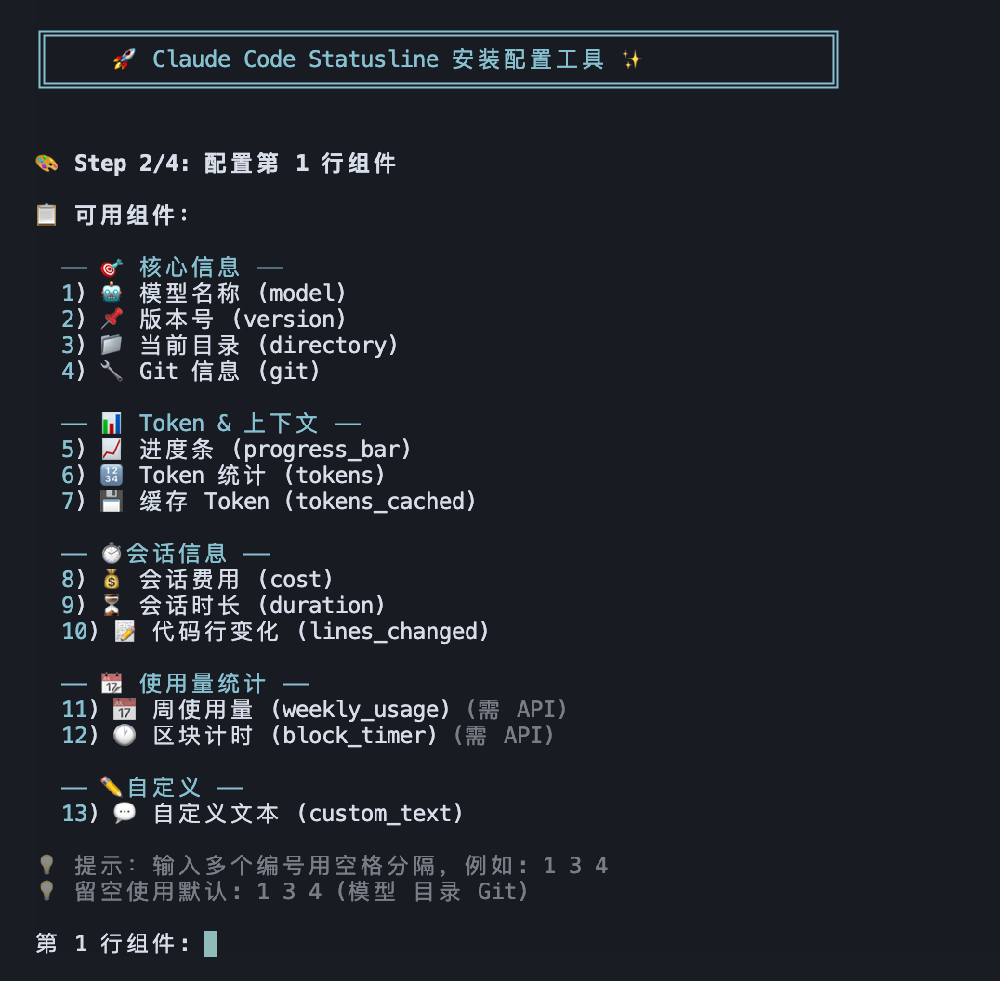
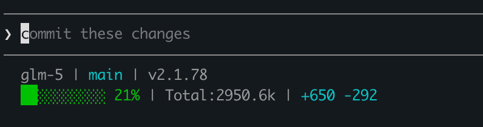

<div align="center">

<pre>
  ____ ____     ____  _        _             _ _            
 / ___/ ___|   / ___|| |_ __ _| |_ _   _ ___| (_)_ __   ___ 
| |  | |   ____\___ \| __/ _` | __| | | / __| | | '_ \ / _ \
| |__| |__|_____|__) | || (_| | |_| |_| \__ \ | | | | |  __/
 \____\____|   |____/ \__\__,_|\__|\__,_|___/_|_|_| |_|\___|
</pre>

# Claude Code Statusline

**🎨 A highly customizable status line for Claude Code CLI**

*Display model info, git branch, token usage, cost tracking and more*

[](https://www.python.org)
[](https://opensource.org/licenses/MIT)
[](https://github.com/yourusername/claude-code-statusline)



</div>

## Preview



## Features

- 🎨 **Fully customizable** - Configure what information to display and how
- 📊 **Context progress bar** - Visual indicator of context window usage with color coding
- 🔀 **Git integration** - Show branch name and change counts
- 🤖 **Model info** - Display current Claude model
- 💰 **Cost tracking** - Session cost display
- ⏱️ **Duration** - Session time tracking
- 🎯 **Multi-line support** - Spread information across multiple lines

## Installation

### Interactive Install (Recommended)

```bash
git clone https://github.com/yourusername/claude-code-statusline.git
cd claude-code-statusline
./install.sh
```

The installer will prompt you to configure:
- **Layout**: Single-line, two-line, or three-line mode
- **Components**: Choose what information to display on each line
- **Token stats**: Show input/output/total tokens
- **Cost**: Show session cost
- **Duration**: Show session duration

### Quick Install

Use default settings (two-line mode, with model/directory/git/progress/tokens/cost):

```bash
./install.sh --quick
```

### Reconfigure

Change your configuration without reinstalling:

```bash
./install.sh --reconfigure
```

### Manual Installation

1. Copy `statusline.py` to `~/.claude/`
2. Copy `config.json` to `~/.claude/statusline-config.json`
3. Add the following to `~/.claude/settings.json`:

```json
{
  "statusLine": {
    "type": "command",
    "command": "python3 ~/.claude/statusline.py"
  }
}
```

4. Restart Claude Code

## Uninstallation

```bash
./install.sh --uninstall
```

## Available Commands

| Command | Description |
|---------|-------------|
| `./install.sh` | Interactive installation |
| `./install.sh --quick` | Quick install with defaults |
| `./install.sh --reconfigure` | Reconfigure options |
| `./install.sh --uninstall` | Remove statusline |

## Configuration

The configuration file is located at `~/.claude/statusline-config.json`.

### Basic Structure

```json
{
  "lines": [
    {
      "components": ["model", "directory", "git"],
      "separator": " | "
    }
  ],
  "progress_bar": {
    "width": 10,
    "filled_char": "█",
    "empty_char": "░",
    "show_percentage": true
  },
  "colors": {
    "enabled": true,
    "low": {"threshold": 50, "color": "green"},
    "medium": {"threshold": 75, "color": "yellow"},
    "high": {"threshold": 90, "color": "red"}
  }
}
```

### Available Components

| Component | Description | Example Output |
|-----------|-------------|----------------|
| `progress_bar` | Visual context usage bar | `████████░░ 45%` |
| `model` | Current Claude model | `Opus 4.6` |
| `directory` | Current working directory | `~/projects/myapp` |
| `git` | Git branch and changes | `main [+2 ~3]` |
| `tokens` | Token statistics | `in:12.5k out:3.2k total:15.7k` |
| `cost` | Session cost | `$0.5234` |
| `duration` | Session duration | `5m30s` |
| `version` | Claude Code version | `v1.0.5` |
| `tokens_cached` | Cached token count | `cached:8.0k` |
| `lines_changed` | Lines added/removed | `+42 -15` |
| `custom_text` | User-defined custom text | `my text` |
| `weekly_usage` | Weekly API usage percentage | `weekly: 12%` |
| `block_timer` | 5-hour block elapsed time | `block: 3h45m` |

### Progress Bar Configuration

```json
{
  "progress_bar": {
    "width": 10,
    "filled_char": "█",
    "empty_char": "░",
    "show_percentage": true
  }
}
```

- `width`: Number of characters in the progress bar
- `filled_char`: Character for filled portion
- `empty_char`: Character for empty portion
- `show_percentage`: Whether to show percentage after the bar

### Color Configuration

```json
{
  "colors": {
    "enabled": true,
    "low": {"threshold": 50, "color": "green"},
    "medium": {"threshold": 75, "color": "yellow"},
    "high": {"threshold": 90, "color": "red"}
  }
}
```

- Colors change based on context window usage percentage
- Available colors: `green`, `yellow`, `orange`, `red`, `blue`, `cyan`, `magenta`

### Token Format

```json
{
  "tokens": {
    "format": "in:{input} out:{output} total:{total}",
    "unit": "k"
  }
}
```

- `format`: Template string with placeholders
- `unit`: `k` for thousands, `m` for millions, `auto` for automatic selection

### Component-Specific Options

```json
{
  "components": {
    "model": {
      "format": "{name}"
    },
    "directory": {
      "max_length": 20,
      "show_git_root": true
    },
    "git": {
      "show_branch": true,
      "show_changes": true
    },
    "cost": {
      "format": "${cost}"
    },
    "duration": {
      "format": "{duration}"
    }
  }
}
```

## Example Configurations

### Minimal

Just the essentials - progress bar and model name:

```json
{
  "lines": [
    {
      "components": ["progress_bar", "model"],
      "separator": " "
    }
  ]
}
```

### Full

Everything enabled with emoji indicators:

```json
{
  "lines": [
    {
      "components": ["model", "directory", "git"],
      "separator": " | "
    },
    {
      "components": ["progress_bar", "tokens", "cost", "duration"],
      "separator": " | "
    }
  ]
}
```

### Compact Single Line

All information on one line:

```json
{
  "lines": [
    {
      "components": ["progress_bar", "model", "directory", "tokens", "cost"],
      "separator": " | "
    }
  ]
}
```

## Testing

Test your configuration without restarting Claude Code:

```bash
echo '{"model":{"display_name":"Opus"},"context_window":{"used_percentage":45,"input_tokens":12500,"output_tokens":3200}}' | python3 ~/.claude/statusline.py
```

## Troubleshooting

### Statusline not showing

1. Verify Python 3 is installed: `python3 --version`
2. Check the script is executable: `ls -la ~/.claude/statusline.py`
3. Verify settings.json has the correct configuration

### Colors not working

Ensure your terminal supports ANSI color codes. Try running:
```bash
echo -e "\033[32mGreen\033[0m"
```

### Git info not showing

Make sure you're in a git repository or subdirectory of one.

## Project Structure

```
Claude-Code-Statusline/
├── README.md           # This file
├── install.sh          # Installation script
├── statusline.py       # Main statusline script
├── config.json         # Default configuration
└── examples/
    ├── minimal.json    # Minimal configuration
    ├── full.json       # Full-featured configuration
    └── multiline.json  # Multi-line layout example
```

## Contributing

Contributions are welcome! Please feel free to submit a Pull Request.

## License

MIT License
